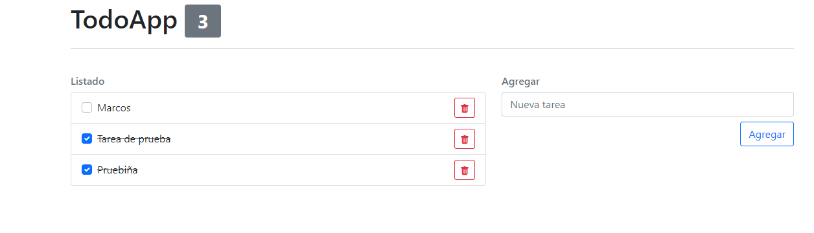

# Todo app

React todo app with **create-react-app**

---

## Screenshot 📸

## Built with 🔨

- create-react-app
- [Bootstrap](https://getbootstrap.com/)
- [React-icons](https://react-icons.github.io/react-icons)
- State management with useReducer
- Hooks (useState, useEffect, useCallback, memo)
- localStorage

## Live demo 📎

[Link](https://todo-app-psi-five.vercel.app) 👈👈👈

### Author 🧔

[Marcos Pennachini](https://linkedin/in/marcos-pennachini)
